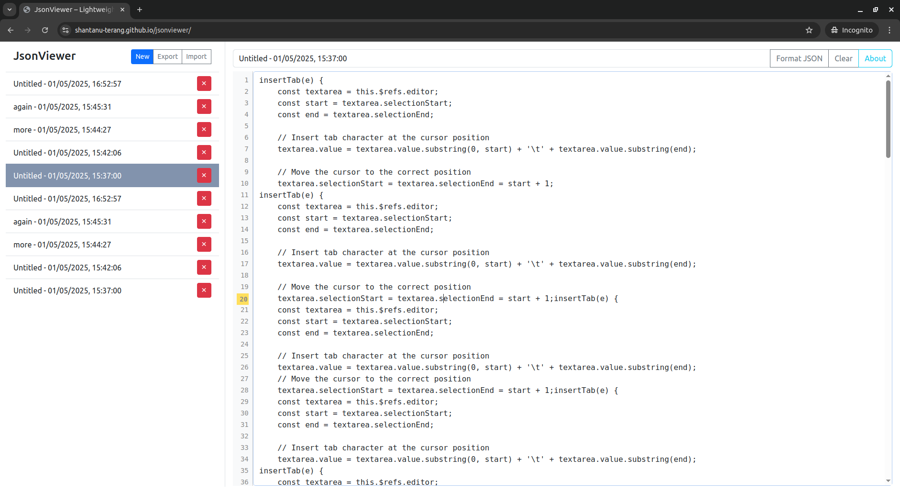

# JsonViewer 📝

**JsonViewer** is a lightweight, browser-based note-taking app focused on editing and storing JSON or plain text notes. It works offline using **IndexedDB**, and is built using **Bootstrap**, **Alpine.js**, and vanilla JavaScript.

## 🚀 Features

- 📁 **Create, Edit, Delete Notes**  
- 💾 **Offline Storage with IndexedDB**
- 📝 **Live Line Numbers & Current Line Highlighting**
- 🎯 **Auto-save with Every Edit**
- ↩️ **Tab Key Insertion**
- 🔍 **JSON Formatting Support**
- ⬆️ **Import Notes from JSON**
- ⬇️ **Export All Notes to JSON File**
- 📱 **Responsive UI for Mobile & Desktop**
- 🎨 **Clean UI with Bootstrap**
- 🔔 **Toast Notifications (via Bootstrap)**

## 📸 Preview



> *Store and manage your JSON notes without any backend or account — just open and go.*

## 📦 Technologies Used

- [Bootstrap 5](https://getbootstrap.com/)
- [Alpine.js](https://alpinejs.dev/)
- [IndexedDB](https://developer.mozilla.org/en-US/docs/Web/API/IndexedDB_API)

## 📂 How to Use

1. **Clone the repository**  
   ```bash
   git clone https://github.com/shantanu-terang/jsonviewer.git
   cd jsonviewer
